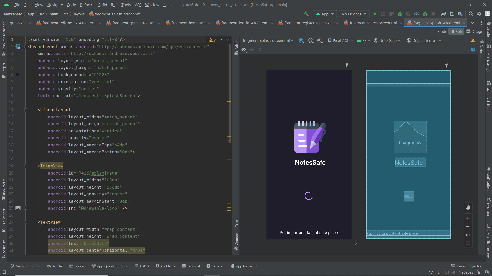
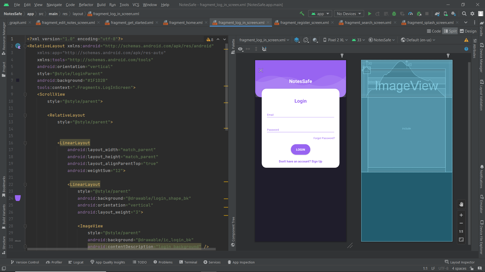
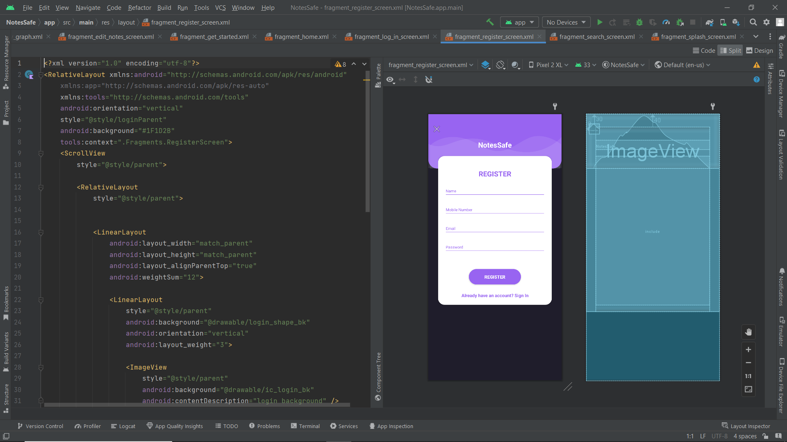
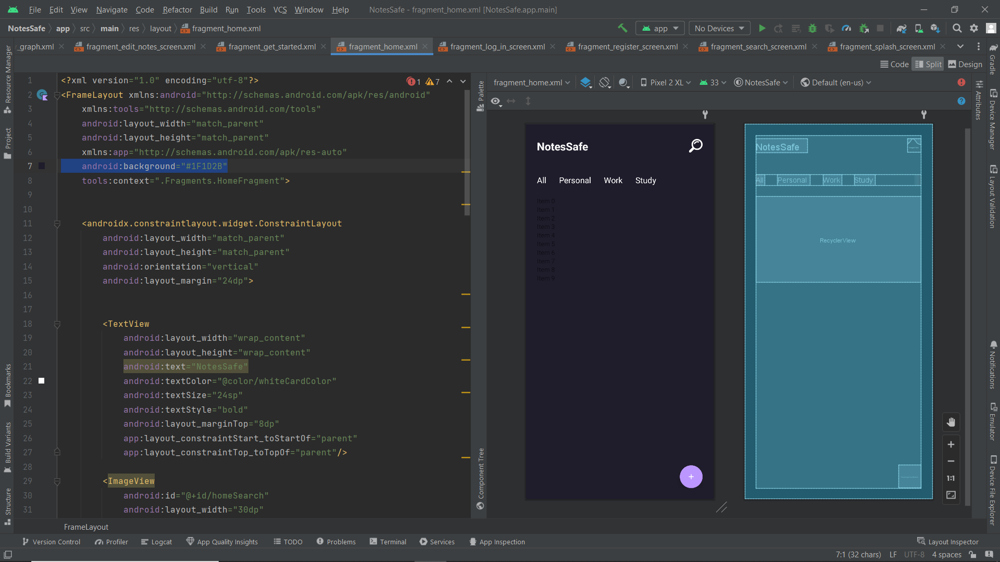
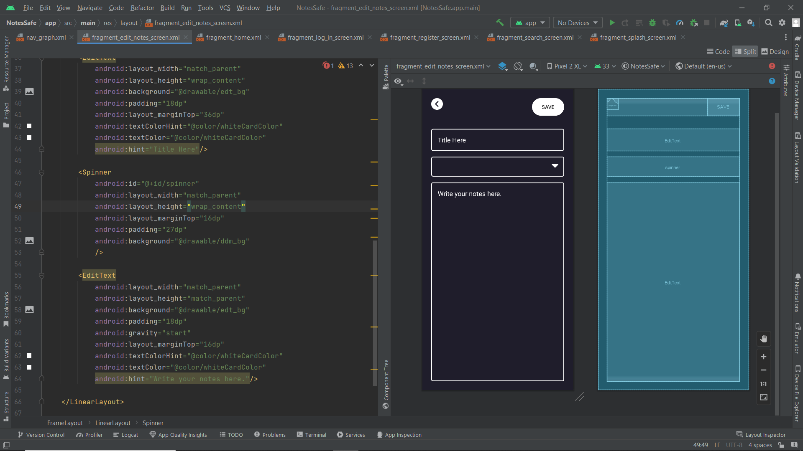
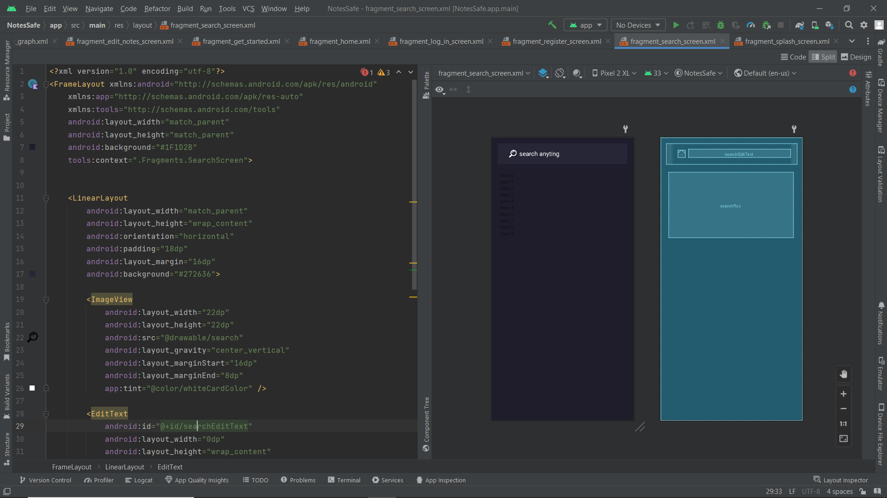

# NotesSafe

NotesSafe is an online notes-saving application that includes the feature of Authentication that will help user log in through their Email or Google account and secure their notes to their account and they will be saved even if they lose their device or change it. Its purpose is just to save important information at a secure and remote location so that they can get it whenever they need it.

<b>Application Overview</b>

<b>1) Splash Screen</b>

<b>2) LogIn Screen</b>

<b>3) Register Screen</b>

<b>4) Home Screen</b>

<b>5) Add Details</b>

<b>6) Search Details</b>

<b>Application Features</b>

<ol>
  <li>Fragments (NavHostFragments)</li>
  <li>Firebase (Authentication)</li>
  <li>Save Notes</li>
  <li>NVVM Architechture</li>
  <li>Clean UI/UX</li>
</ol>
